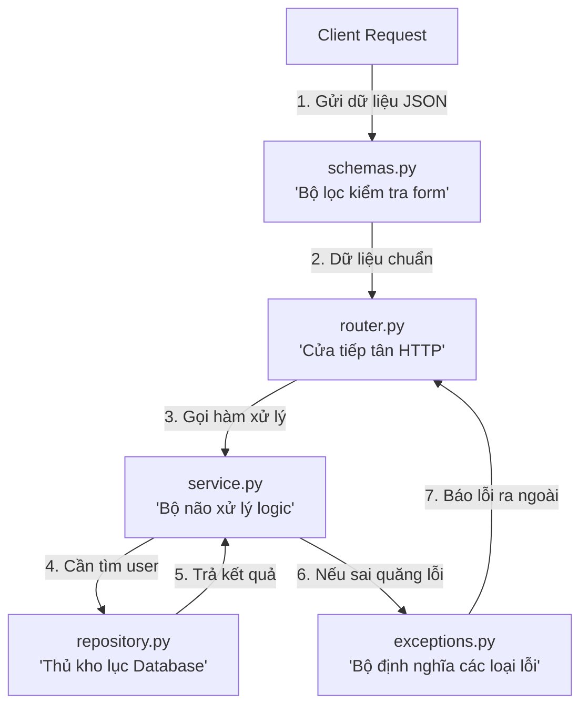

# 📚 BÍ KÍP TOÀN TẬP: GIẢI MÃ KIẾN TRÚC & CÚ PHÁP LẠ (VISION LMS)

> Tài liệu này được viết theo cách **dễ hiểu nhất**, giải thích tường tận từ:
> 1. Tại sao lại đẻ ra nhiều thư mục lồng nhau như vậy?
> 2. Các file `router`, `service`, `repository`, `schemas`, `exceptions` sinh ra để làm gì?
> 3. Giải mã tất cả các "cú pháp lạ", thư viện bí ẩn trong toàn bộ dự án.

---

## 🗺️ PHẦN 1: BẢN ĐỒ CẤU TRÚC THƯ MỤC (TẠI SAO LỒNG NHAU LẮM THẾ?)

Dự án này được thiết kế theo chuẩn **Modular Architecture (Kiến trúc theo Module)** của các công ty công nghệ lớn.

### 1. Phía Backend (`backend/app/`)

```text
backend/app/
├── core/                  # 🧠 Não bộ & Trái tim (Dùng chung cho toàn bộ dự án)
│   ├── config.py          # Đọc file .env (DB_URL, SECRET_KEY...)
│   ├── security.py        # Các hàm băm mật khẩu (Bcrypt), tạo & giải mã JWT Token
│   ├── dependencies.py    # Các "bộ lọc" dùng chung (Lấy user_id từ Token, check role...)
│   └── logger.py          # Hệ thống ghi log (In màu ra terminal, ghi ra file)
│
├── database/              # 🔌 Cầu nối với Cơ sở dữ liệu
│   └── database.py        # Tạo kết nối SQLAlchemy, hàm get_db() quản lý đóng/mở kết nối
│
├── models/                # 🗄️ Bảng Database thực tế (ORM Models)
│   └── user.py            # Bảng 'users' trong database có các cột gì (id, phone, password...)
│
└── modules/               # 📦 Các tính năng nghiệp vụ cụ thể (Chia theo từng chức năng)
    └── auth/              # Module xác thực người dùng
        ├── login/         # Tính năng Đăng nhập
        └── change_password/ # Tính năng Đổi mật khẩu
```

---

### 2. Bên trong mỗi Module con: 5 File này chia nhau làm gì?

Ví dụ trong `modules/auth/login/` bạn thấy có 5 file:



| Tên File | Vai trò đời thực | Nhiệm vụ cụ thể trong code |
| :--- | :--- | :--- |
| **`schemas.py`** | **Tờ phiếu điền thông tin** | Dùng `Pydantic` định nghĩa: Form gửi lên gồm những trường gì (VD: `phone_number`, `password`), kiểu dữ liệu gì. |
| **`router.py`** | **Nhân viên tiếp tân** | Nhận HTTP Request từ bên ngoài (`@router.post("/login")`). Không làm việc nặng, chỉ nhận request rồi chuyển tiếp cho Service. |
| **`service.py`** | **Bộ não xử lý logic** | Quyết định logic: Kiểm tra SĐT có đủ 10 số không? Mật khẩu có khớp không? Tạo token JWT trả về. |
| **`repository.py`** | **Thủ kho dữ liệu** | Chỉ làm việc với Database: Viết câu lệnh SQLAlchemy tìm user theo SĐT, tìm user theo ID. |
| **`exceptions.py`** | **Danh sách các loại lỗi** | Định nghĩa các lỗi riêng của tính năng (VD: `UserNotFoundException`, `WrongPasswordException`). |

> 🎯 **Tại sao không viết hết vào 1 file cho nhanh?**
> * Viết 1 file thì ban đầu nhanh, nhưng khi dự án lên 100 API sẽ thành "núi rác" 5000 dòng, không ai dám sửa.
> * Chia 5 file: Lỗi ở đâu vào đúng file đó sửa. Sau này muốn đổi từ MySQL sang MongoDB **chỉ cần sửa file `repository.py`**, các file còn lại giữ nguyên 100%!

---

### 3. Phía Frontend (`frontend/src/`)

Frontend cũng được chia theo từng **Tính năng (Feature-based)** tương ứng:

```text
frontend/src/
├── config/           # Cấu hình biến môi trường (VITE_API_URL...)
├── lib/              # Cấu hình các thư viện bên thứ 3 (axios.ts...)
└── features/         # Các màn hình/tính năng
    └── auth/         # Tính năng Auth
        ├── components/  # Các khối giao diện nhỏ (LoginForm.tsx, InputField.tsx...)
        ├── pages/       # Trang hoàn chỉnh gắn vào Router (LoginPage.tsx...)
        ├── services/    # Các hàm gọi API Backend (authService.ts...)
        ├── schemas/     # Validate form phía frontend (Zod schema...)
        └── types/       # Kiểu dữ liệu TypeScript (User, LoginResponse...)
```

---

## 🪄 PHẦN 2: GIẢI MÃ CÁC CÚ PHÁP & THƯ VIỆN "LẠ"

### 1. `@router.post("/login")` (Decorator trong Python)
* **Ý nghĩa:** Dấu `@` gọi là **Decorator**. 
* **Tác dụng:** Nó "dán nhãn" cho hàm bên dưới. Báo cho FastAPI biết: *"Khi có ai gửi phương thức `POST` tới đường dẫn `/login`, hãy chạy hàm này!"*.

---

### 2. `Depends(...)` (Dependency Injection - Tiêm phụ thuộc)
* **Ví dụ:** `auth_service: LoginService = Depends(get_auth_service)` hoặc `user_id = Depends(get_current_user_id)`
* **Ý nghĩa:** Bạn không cần phải tự viết code khởi tạo `auth_service = LoginService(...)` trong hàm.
* **FastAPI tự làm:** FastAPI sẽ tự chạy hàm trong `Depends()`, lấy kết quả ra và **nhét thẳng vào tham số** cho bạn dùng.

---

### 3. `HTTPBearer()` & `credentials.credentials`
* **Ý nghĩa:** Công cụ đọc Header Authorization tự động.
* **FastAPI tự làm:** Tự thò tay vào Header lấy chuỗi `Bearer <token>`, cắt bỏ chữ `"Bearer "` và ném chuỗi token sạch vào `credentials.credentials`. Nếu không có token, nó **tự động chặn lại và trả lỗi 403/401** ngay lập tức.

---

### 4. `yield` trong `get_db()` (Khác gì với `return`?)
```python
def get_db():
    db = SessionLocal()
    try:
        yield db      # 1. Tạm dừng ở đây, đưa db cho API dùng
    finally:
        db.close()    # 2. Sau khi API chạy xong (kể cả bị lỗi), tự động dọn dẹp đóng kết nối!
```
* **Tại sao không dùng `return`?** Nếu `return`, hàm sẽ kết thúc ngay và không bao giờ chạy được dòng `db.close()`. Dùng `yield` giúp bảo vệ hệ thống **không bao giờ bị tràn RAM hoặc nghẽn kết nối database**.

---

### 5. `Bcrypt` (Salt là cái quái gì?)
* **Tại sao không lưu mật khẩu thô vào Database?** Nếu Database bị lộ, hacker sẽ thấy hết mật khẩu của người dùng.
* **Salt (Muối):** Là một chuỗi ký tự ngẫu nhiên được thêm vào mật khẩu trước khi băm.
* **Tác dụng:** Cùng là mật khẩu `"123456"`, nhưng mỗi người dùng sẽ được trộn với một hạt muối khác nhau, tạo ra 2 chuỗi băm hoàn toàn khác nhau -> Hacker không thể dùng bảng tra cứu sẵn (Rainbow Table) để dịch ngược mật khẩu.

---

### 6. `JWT` (JSON Web Token - `jwt.encode` & `jwt.decode`)
* **Bản chất:** JWT giống như một **"Chiếc thẻ căn cước đóng dấu đỏ"**.
* **`create_access_token` (`jwt.encode`):** Đóng gói thông tin `{"id": 1, "role": "student"}` + thời hạn hết hạn (`exp`) + ký tên bằng con dấu bí mật `SECRET_KEY`.
* **`decode_access_token` (`jwt.decode`):** Soi lại chữ ký bằng `SECRET_KEY`. Nếu chuẩn dấu mộc thì mở ruột ra đọc `user_id`. Nếu bị kẻ gian sửa dù chỉ 1 ký tự, chữ ký sẽ hỏng ngay và bị từ chối.

---

### 7. `Axios Interceptors` (Ở Frontend)
* **Ý nghĩa:** Là một **"Trạm thu phí tự động"** trước khi request bay ra khỏi trình duyệt hoặc khi response trả về.
* **Request Interceptor:** Tự động lấy Token từ `localStorage` và dán vào Header `Authorization: Bearer <token>` cho mọi request mà bạn không cần phải viết tay lặp lại ở 100 hàm gọi API.
* **Response Interceptor:** Tự động bắt lỗi từ Backend (như Token hết hạn, sai mật khẩu) để thông báo đẹp mắt ra giao diện.

---

## 💡 BẢNG TRA CỨU NHANH TỪ KHÓA LẠ

| Cú pháp / Từ khóa | Nó là cái gì? | Hiểu nôm na là gì? |
| :--- | :--- | :--- |
| `BaseModel` | Thư viện **Pydantic** | Khuôn đúc dữ liệu, tự động kiểm tra xem dữ liệu gửi lên đúng kiểu không. |
| `Session` / `SessionLocal` | Thư viện **SQLAlchemy** | Một phiên làm việc với Database (giống như mở 1 tab kết nối SQL). |
| `status_code=401` | Mã trạng thái HTTP | Báo lỗi: *"Chưa đăng nhập hoặc Token không hợp lệ"*. |
| `status_code=403` | Mã trạng thái HTTP | Báo lỗi: *"Đã đăng nhập nhưng không có quyền truy cập"* (VD: Học sinh đòi vào trang Admin). |
| `status_code=400` | Mã trạng thái HTTP | Báo lỗi: *"Dữ liệu gửi lên bị sai format"* (VD: SĐT không đủ 10 số). |
| `sub` (Subject trong JWT) | Chuẩn quốc tế của JWT | Trường chuẩn lưu ID hoặc danh tính chính của người dùng bên trong Token. |
| `KaTeX` | Thư viện Toán học | Giúp hiển thị công thức Toán/Lý/Hóa đẹp như sách giáo khoa trên Web. |

---

## 🔐 PHẦN 3: TỔNG HỢP KIẾN THỨC VỪA HỌC (AUTHENTICATION & DEPENDENCIES)

### 1. Tại sao không lấy token từ `create_access_token` mà phải giải mã lại qua `dependencies.py`?
* **Quy luật In vé vs Soát vé:**
  * **`create_access_token` (Nhà máy in vé):** Chỉ chạy **1 lần duy nhất** khi đăng nhập thành công. Tạo ra token rồi đưa cho Client (trình duyệt) giữ trong `localStorage`. Server **không lưu token vào RAM hay biến toàn cục** (tính chất Stateless của RESTful API).
  * **`get_current_user_id` (Cửa soát vé):** Chạy ở **mọi request sau đó** (đổi mật khẩu, xem khóa học, nộp bài...). Client phải tự kẹp "vé" vào Header gửi lên để Server soi và xác định: *"Request này là của User ID nào?"*.

---

### 2. Bộ đôi `HTTPBearer()` và `HTTPAuthorizationCredentials`
* **`HTTPBearer()` (Máy quét cổng):** 
  * Tự động tìm Header `Authorization: Bearer <token>`.
  * Nếu không có Header hoặc sai cú pháp `Bearer `, **chặn lại ngay lập tức và trả lỗi 401/403**.
  * Tự động hiển thị nút ổ khóa 🔒 trên Swagger UI (`/docs`).
* **`HTTPAuthorizationCredentials` (Chiếc phong bì đựng vé):**
  * Object chứa dữ liệu sau khi quét:
    * `credentials.scheme` = `"Bearer"`
    * `credentials.credentials` = **Chuỗi token JWT sạch nguyên bản** để đem đi giải mã.

---

### 3. `JWTError` bắt những lỗi gì?
Hàm `decode_access_token` sẽ quăng lỗi `JWTError` trong 3 tình huống:
1. ⏰ **Token hết hạn (`exp`):** Thời gian sống của token đã trôi qua.
2. 🕵️‍♂️ **Token giả mạo / Sai chữ ký:** Kẻ gian tự sửa nội dung hoặc token không được ký bởi `SECRET_KEY` của hệ thống.
3. 💥 **Token hỏng / Sai format:** Gửi lên chuỗi rác không đúng cấu trúc 3 phần `header.payload.signature`.

---

### 4. Quy tắc vàng khi dùng `Depends(...)` trong FastAPI
* **Luôn truyền TÊN HÀM, KHÔNG có ngoặc tròn `()`:**
  * ✅ Đúng: `user_id: int = Depends(get_current_user_id)`
  * ❌ Sai: `user_id: int = Depends(get_current_user_id())`
* **Cơ chế Tiêm tự động (Sub-dependency Chaining):**
  * Bạn không cần tự gọi `get_current_user_id(...)` hay tự truyền `credentials` vào.
  * FastAPI sẽ tự phân tích tham số từ dưới lên: `HTTPBearer` -> `credentials` -> `get_current_user_id` -> `user_id` -> nhét vào Router!

---

### 5. Chuẩn mã hóa `status` trong FastAPI
* Tránh dùng số cứng (Magic Number) như `401`, `400`, `404`.
* Import chuẩn: `from fastapi import status` (không import từ `fastapi.security`).
* Sử dụng hằng số rõ nghĩa:
  * `status.HTTP_401_UNAUTHORIZED` (Chưa đăng nhập / Token sai / Token hết hạn)
  * `status.HTTP_400_BAD_REQUEST` (Dữ liệu gửi lên không hợp lệ / Thiếu mật khẩu)
  * `status.HTTP_404_NOT_FOUND` (Không tìm thấy dữ liệu / User không tồn tại)

---
*Ghi chú được cập nhật tự động khi dự án có thêm tính năng mới.* 🚀

