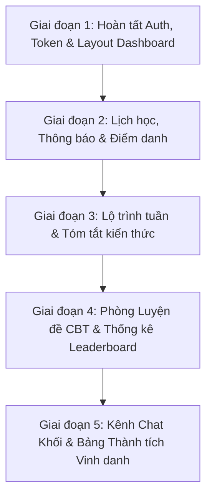

# 🎓 VISION EDUCATION LMS - MASTER SPECIFICATION & ROADMAP

> **Hệ thống Quản lý Học tập & Luyện thi Chuyên sâu - Vision Education LMS**
> Thiết kế chuẩn CBT (Computer-Based Testing), Gamification & Hệ sinh thái học tập tương tác cao.

---

## 🌟 TỔNG QUAN TÍNH NĂNG TOÀN DIỆN (SYSTEM MODULES)

### 1. 🛡️ Module 1: Authentication & Phân quyền (RBAC)
- **3 Vai trò chính:** `Admin` (Quản trị viên), `Teacher` (Giáo viên), `Student` (Học sinh).
- Xác thực số điện thoại & mật khẩu băm Bcrypt, cấp mã JWT Token.
- Bảo vệ chống quét tài khoản (Enumeration Attack) & Axios Request/Response Interceptors.

---

### 2. 🏛️ Module 2: Phòng Luyện đề & Thi ảo THPTQG (CBT Engine)
- **Luyện đề thi thử chuẩn quốc gia:**
  - Đồng hồ đếm ngược (Countdown Timer) + Tự động nộp bài khi hết giờ.
  - Bảng điều hướng câu hỏi trực quan (Đã làm / Chưa làm / Đánh dấu xem lại).
  - Hỗ trợ công thức Toán/Lý/Hóa sắc nét với `KaTeX`.
  - Hỗ trợ 3 định dạng đề mới: Trắc nghiệm 4 đáp án, Đúng/Sai, Điền số ngắn.
- **Trộn đề ngẫu nhiên:** Đảo thứ tự câu hỏi và đảo thứ tự đáp án (A, B, C, D) cho từng học sinh.
- **Thống kê & Đánh giá chuyên sâu (Exam Analytics):**
  - **Leaderboard:** Bảng xếp hạng điểm số theo **Tuần / Tháng / Năm**.
  - **Phân tích lỗ hổng kiến thức:** Chỉ rõ phần kiến thức học sinh còn yếu cần cải thiện (Weakness Gap Analysis).
  - **Đánh giá độ khó:** Phân loại câu hỏi theo 4 mức độ (Nhận biết, Thông hiểu, Vận dụng, Vận dụng cao).
  - **Item Analysis:** Thống kê câu hỏi nào học sinh trong lớp/khối làm sai nhiều nhất để giáo viên chữa bài.

---

### 3. 🗺️ Module 3: Lộ trình Học tập & Tóm tắt Kiến thức (Roadmap & Weekly Summary)
- **Tổng hợp lộ trình theo tuần:** Lộ trình chi tiết từng tuần của khóa học (Tuần 1, Tuần 2, ...).
- **Tóm tắt kiến thức theo tuần:** Bản tóm tắt lý thuyết, mindmap, công thức cốt lõi sau mỗi tuần học.
- **Thảo luận dưới bài học / bài tập:** Học sinh có thể bình luận, hỏi đáp và trao đổi dưới từng bài tập hoặc từng tuần học.

---

### 4. 📅 Module 4: Lịch học, Điểm danh & Thông báo Lớp học
- **Thời khóa biểu theo khối:** Lịch học chi tiết chia theo từng khối (Khối 10, Khối 11, Khối 12).
- **Điểm danh buổi học:** Ghi nhận chuyên cần từng buổi (Có mặt, Đi muộn, Vắng mặt).
- **Hệ thống thông báo thời gian thực:** Bắn thông báo ngay lập tức khi giáo viên đổi lịch hoặc dời lịch học.
- **Lịch sử lớp học:** Xem lại nhật ký các buổi học đã diễn ra, nội dung đã dạy và tài liệu đính kèm.

---

### 5. 💬 Module 5: Kênh Chat & Cộng đồng Học tập
- **Kênh Chat theo Khối:** Phòng chat chung cho toàn bộ học sinh trong cùng khối (VD: Kênh Khối 12).
- Trao đổi học tập, chia sẻ tài liệu và hỏi bài trực tiếp với bạn bè & trợ giảng.

---

### 6. 🏆 Module 6: Bảng Thành tích & Vinh danh (Hall of Fame)
- **Bảng vàng thành tích các năm:** Tôn vinh các thủ khoa, á khoa, học sinh đạt điểm cao trong các kỳ thi THPTQG các năm trước.
- Tạo động lực và mục tiêu học tập cho học sinh khóa sau.

---

## 🚀 KẾ HOẠCH TRIỂN KHAI TỪNG BƯỚC (ROADMAP)

### 📍 Giai đoạn 1: Khung nền tảng (Foundation)
1. Thêm `useNavigate` sang Dashboard & Request Interceptor kẹp `Bearer Token`.
2. Dựng Layout Dashboard hoàn chỉnh (Sidebar, Header, Profile `/auth/me`).

### 📍 Giai đoạn 2: Lịch học & Điểm danh (Schedule & Attendance)
1. Quản lý thời khóa biểu theo khối + Thông báo đổi lịch.
2. Quản lý học viên & module Điểm danh chuyên cần.

### 📍 Giai đoạn 3: Lộ trình & Tóm tắt tuần (Curriculum & Summary)
1. Dựng trang Lộ trình học theo tuần + Tóm tắt kiến thức.
2. Khung thảo luận / bình luận hỏi đáp dưới bài tập.

### 📍 Giai đoạn 4: Trọng tâm - Phòng Thi ảo CBT & Phân tích (Exam & Analytics)
1. Giao diện phòng thi chuẩn kỳ thi thật (Đồng hồ, KaTeX, Auto-save).
2. Thuật toán đảo đề, chấm điểm, thống kê câu sai nhiều nhất & Leaderboard tuần/tháng/năm.

### 📍 Giai đoạn 5: Kênh Chat & Bảng Thành tích (Community & Hall of Fame)
1. Chatbox realtime cho học sinh trong khối.
2. Trang Bảng vàng vinh danh học sinh xuất sắc qua các năm.
